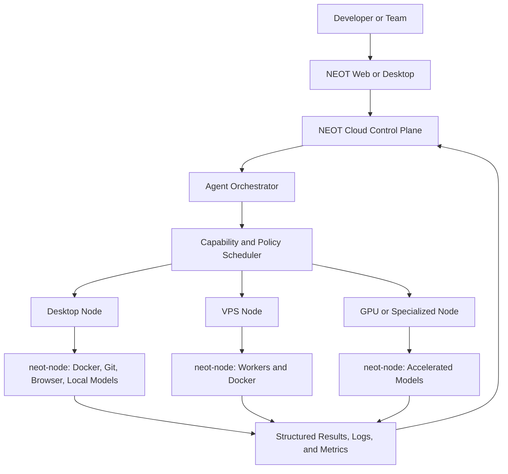

# NEOT Future Platform Blueprint

> Status: planned architecture for later implementation. This document does not describe current
> runtime capability and does not authorize implementation by itself.

## 1. Purpose and Precedence

This blueprint records the intended evolution of NEOT into a local-first, hybrid developer and
engineering orchestration platform. NEOT remains the external product label; `neot`
remains the internal technical name.

Until a roadmap phase is explicitly approved and implemented, the current repository contracts
take precedence:

- NEOT is a standalone, local-authenticated, single-client modular monolith.
- Platform owns identity, executable API and web servers, composition, and one MariaDB connection.
- NEOT modules own engineering product behavior.
- Browser and API routes remain under `/app/neot/*` and `/api/neot/*`.
- Planned multi-user, multi-node, agent execution, model routing, and cloud-control features must
  not be presented as available.

The long-term architectural principle is:

> Compute locally, coordinate through cloud, and use cloud resources only when required.

## 2. Mission and Product Principles

NEOT should become an engineering operating platform where developers, projects, source code,
local machines, VPS and GPU nodes, AI agents, sub-agents, models, Docker, Git, GitHub, previews,
deployments, Cloudflare, testing, reviews, and metrics participate in one controlled workflow.

The product should:

- orchestrate the tools developers already use instead of replacing all of them;
- make Project the primary context for planning, execution, review, deployment, and observation;
- support local, cloud, and hybrid execution, with hybrid plus local-first as the default;
- keep cloud services focused on coordination instead of heavy compute;
- remain model-independent and allow local and remote AI providers;
- scope permissions, isolate execution, require approval for risky actions, and audit outcomes;
- remain useful offline and synchronize bounded metadata when connectivity returns;
- grow from one developer machine to a distributed node network without a fundamental rewrite.

The intended lifecycle is:

```text
Plan -> Develop -> Assist -> Delegate -> Build -> Test -> Review
     -> Preview -> Approve -> Deploy -> Monitor -> Improve
```

## 3. Target System Topology



The cloud control plane coordinates authentication, organizations, workspaces, project metadata,
policies, agent and model configuration, synchronization, notifications, GitHub integrations,
webhooks, deployment metadata, activity, metrics summaries, and remote access.

Compute nodes perform repository analysis, indexing, AI coding, builds, tests, browser automation,
development servers, Docker workloads, local databases, sensitive project processing, and local
model inference whenever policy and capability permit.

## 4. Technology Direction

Use the existing TypeScript ecosystem unless evidence justifies a change:

| Area                  | Direction                                                       |
| --------------------- | --------------------------------------------------------------- |
| Web                   | React, TypeScript, Tailwind CSS, shared UI components, Zod      |
| API and control plane | Node.js, TypeScript, Fastify, Zod, MariaDB                      |
| Local node runtime    | Node.js, TypeScript, Docker, Git, Linux-compatible execution    |
| Desktop               | Tauri 2, React, TypeScript                                      |
| Source control        | Git and GitHub                                                  |
| Infrastructure        | Ubuntu, Docker, Cloudflare, Cloudflare Tunnel                   |
| AI                    | Provider-neutral gateway supporting local and remote model APIs |

The approved tool choices and delivery gates are in `agent-ide-toolchain.md`. That document keeps
current tools separate from planned tools and prevents unused runtime dependencies.

Rust may support Tauri or proven low-level needs. The orchestration system must not be rewritten in
Rust without a demonstrated requirement.

MariaDB remains the database. Do not migrate the ecosystem to PostgreSQL, redesign existing tables
without need, or break existing applications. New persistence must use module-owned repositories,
additive migrations, repeatable seeds where appropriate, transactions, and explicit adapters for
existing ecosystem data.

## 5. Current and Target Boundaries

| Concern       | Current state                                     | Target state                                                 |
| ------------- | ------------------------------------------------- | ------------------------------------------------------------ |
| Installation  | Standalone single-client application              | Local, cloud, and hybrid installations                       |
| Identity      | Local users, roles, and permissions               | Organization, Workspace, Project, Environment membership     |
| Execution     | Application server and guarded deployment tooling | Distributed `neot-node` execution network                  |
| Agents        | Validated catalog definitions                     | Executable multi-agent and sub-agent workflows               |
| Models        | No model execution gateway                        | Local and remote provider-neutral routing                    |
| Isolation     | Repository and deployment safeguards              | Worktrees, branches, Docker, quotas, conflict gates          |
| Sync          | Existing bounded sync module                      | Offline queue and versioned node/cloud protocol              |
| Observability | Existing project and repository signals           | End-to-end node, run, model, deployment, and audit telemetry |
| Desktop       | Web application                                   | Tauri desktop acting as a real compute node                  |

Crossing from the current single-client data model to multi-user tenancy requires a dedicated
architecture decision and migration. A tenant selector or second application shell is not an
acceptable substitute.

## 6. Cloud Control Plane

The first cloud/control node may run on an Ubuntu Hostinger KVM4-class VPS with approximately four
CPU cores, 16 GB RAM, 200 GB storage, and 16 TB bandwidth. Treat these figures as an initial
capacity assumption that must be revalidated before deployment.

Suitable workloads include Fastify APIs, authentication, MariaDB metadata, the web application,
orchestration coordination, synchronization, GitHub integration, Cloudflare connectivity,
notifications, and lightweight workers. Heavy AI inference belongs on capable local or dedicated
compute nodes.

The control plane should never require repositories, Docker images, model data, or large build
artifacts to be uploaded continuously. Synchronize metadata, tasks, run state, small artifacts,
activity, metrics summaries, deployment state, and configuration unless a project explicitly
requires more.

## 7. Desktop and Local Runtime

The future Tauri desktop is both a user interface and an execution node. Its primary surfaces are
Projects, Files, Git, Terminal, Assist, Agents, Tasks, Builds, Tests, Preview, Logs, Cloud, and Node
Status.

```text
React UI -> Tauri boundary -> NEOT local runtime -> Docker, Git, agents, models, browser, OS
```

Each capable machine runs `neot-node`, which will:

- register and authenticate the node;
- send heartbeats and capability reports;
- receive, start, cancel, and complete jobs;
- create isolated workspaces and agent environments;
- manage Docker containers, Git operations, builds, tests, browsers, and previews;
- execute agents, sub-agents, and permitted local models;
- stream structured output and logs;
- enforce resource budgets and project policy;
- synchronize results, health, and bounded metrics.

The desktop remains useful offline for files, Git, Docker, local agents and models, builds, tests,
and development servers. Offline changes enter a retryable sync queue when connectivity returns.

## 8. Node Model and Secure Protocol

Every execution machine uses one node abstraction:

```text
Node
  id, name, type, status, version
  CPU, memory, storage, GPU, current load
  Docker, Git, browser, network, model and agent capabilities
  assigned projects and running jobs
  health and last heartbeat
```

Initial node types are Desktop, VPS, Server, GPU Node, and Cloud Node. Every node receives a unique
identity; credentials are never shared across all nodes.

Registration follows this sequence:

```text
Issue one-time registration token -> Install neot-node -> Register
-> Authenticate -> Receive node identity -> Heartbeat -> Report capabilities
```

Nodes prefer outbound authenticated HTTPS or WebSocket connections. Execution APIs should not be
exposed directly to the public internet. Use encrypted transport, short-lived credentials where
appropriate, key rotation, revocation, replay protection, and protocol-version negotiation.

Versioned node messages include:

```text
REGISTER, HEARTBEAT, JOB_ASSIGN, JOB_START, JOB_OUTPUT, JOB_LOG,
JOB_CANCEL, JOB_COMPLETE, JOB_FAILED, NODE_STATUS, SYNC, SYNC_RESULT
```

Important messages must use validated Zod schemas and idempotency identifiers.

## 9. Scheduler and Execution Modes

The scheduler selects a node, agent, model, container profile, and resource budget. Placement
considers CPU, memory, GPU, disk, current load, capability availability, privacy, project policy,
network requirements, cost, and latency. Placement decisions must be explainable and auditable.

Execution modes are:

- **Local:** the desktop runtime executes directly on the developer machine.
- **Cloud:** the control plane assigns a remote node.
- **Hybrid:** the scheduler chooses a permitted local or remote node and synchronizes the result.

Hybrid with local-first placement is the default. A task must not move to cloud merely because a
local attempt failed; fallback still obeys privacy, project, workspace, and user policy.

## 10. Multi-User Authorization Target

The target hierarchy is:

```text
Organization -> Workspace -> Project -> Environment -> Tasks, Agents, Nodes, Deployments
```

Users may participate in multiple workspaces and have different permissions by workspace,
project, and environment. Initial role concepts are Owner, Admin, Manager, Developer, AI Operator,
Reviewer, DevOps, and Viewer, backed by granular permissions such as:

```text
project.read, project.write, agent.execute, agent.configure,
deployment.create, deployment.approve, node.manage, model.configure
```

Implementation must cover identity migration, row ownership, authorization, storage isolation,
audit, background jobs, sync, existing-record assignment, and deployment compatibility before the
product can claim multi-user isolation.

## 11. Agent Orchestration

Do not design one unrestricted agent. The orchestrator manages specialized Planning, Coding,
Review, Testing, DevOps, Security, Frontend, Backend, Database, and other policy-approved profiles.

Major agent operations follow:

```text
Understand -> Inspect -> Plan -> Decompose -> Delegate -> Execute
-> Verify -> Review -> Integrate -> Report
```

Independent tasks may run in parallel as a directed acyclic workflow. Integration waits for
dependencies and then passes through testing and review gates. Agent and sub-agent communication
uses structured events and results, not only free-form text.

Sub-agents receive the minimum context, tools, permission ceiling, model access, and budget needed
for their task. They do not automatically inherit every parent permission.

Multiple coding agents must not modify the same working tree freely. Use branches, Git worktrees,
isolated directories, containers, change sets, conflict detection, controlled integration, and
quality gates.

Each run supports maximum CPU, memory, disk, duration, tokens, tool calls, files changed,
sub-agents, and cost. Exhausting a budget produces a visible bounded result, never silent runaway
execution.

## 12. Model Gateway and Project AI Policy

Agents request capabilities; they do not hardcode providers. The Model Gateway and router select a
model using task type, required capability, complexity, privacy, latency, cost, context size,
availability, and project, workspace, and user policies.

Local model adapters may support Ollama, vLLM, and compatible local APIs. Local models are preferred
for private source, large repositories, offline use, sensitive projects, and high-volume work.
Remote APIs may supply advanced reasoning, vision, specialized capabilities, or larger context when
policy permits. Provider credentials remain server- or node-side and are never exposed to frontend
clients or unauthorized agents.

Each project declares one AI mode:

- `LOCAL_ONLY`: no automatic public-provider fallback;
- `CLOUD_ONLY`: use approved remote providers;
- `HYBRID`: route per task and policy.

Fallback is explicit, ordered, observable, and policy-constrained.

## 13. Project Twin and Assist

Each project should eventually maintain a structured, machine-readable Project Twin containing
architecture, applications, repositories, dependencies, database, infrastructure, environments,
agents, tasks, deployments, health inputs, risks, and rules.

Agents receive only relevant context selected from the Project Twin and live repository evidence;
the entire project should not be sent with every model request.

Assist is the main intelligent interface and understands the actor, workspace, project, current
task, repository, files, Git state, agents, models, rules, node capabilities, builds, deployments,
logs, metrics, and Project Twin. Its modes remain Ask, Plan, Build, Debug, Review, Test, Deploy,
Analyze, and Explain.

Assist should accept screenshots, architecture diagrams, error images, and UI designs. The intended
visual workflow is iterative:

```text
Analyze image -> Select project context -> Plan -> Implement -> Build -> Preview
-> Capture -> Compare -> Improve -> Human review
```

The goal is generate, run, compare, and improve—not unverified one-shot code generation.

## 14. Docker, Preview, and Deployment

Docker is the primary execution-isolation layer for agents, builds, tests, previews, and temporary
environments. Container profiles enforce resource and network policy and must not silently mount
unrelated host directories or credentials.

The deployment path should connect source, build, test, artifact, preview, approval, deployment,
health verification, and rollback evidence. Cloudflare Tunnel may expose explicitly approved
preview environments without exposing node execution APIs.

The repository's guarded updater remains authoritative until a later deployment runtime replaces
it through an approved migration. Application image rollback does not reverse migrations or seeds.

## 15. Sync and Data Transfer

The future sync engine uses change detection, an ordered queue, secure APIs, conflict handling,
retry, deduplication, partial-sync recovery, and version compatibility. It must work across offline
periods and reconnects without overwriting newer data silently.

Large repositories, build artifacts, Docker images, sensitive files, and local model data remain
local unless policy and a concrete workflow require transfer. Every transfer records purpose,
scope, destination, actor or agent, and result.

## 16. Security and Human Approval

Security is a system boundary, not an agent prompt. Always authenticate nodes and users, authorize
actions, scope agent permissions, validate tool input, encrypt communication, sandbox execution,
protect secrets, and audit sensitive actions.

Never expose provider credentials, write secrets to logs, grant unrestricted agent permissions,
permit arbitrary production operations, publish node execution APIs unnecessarily, or upload
sensitive files without policy approval.

Production deployment, destructive database operations, infrastructure destruction, DNS changes,
secret changes, protected-branch updates, and production-data modification require:

```text
Agent proposal -> Risk assessment -> Human approval -> Execution -> Verification -> Audit
```

Approvals are bound to a specific action, target, change set, expiry, and actor; they are not
reusable blanket authorization.

## 17. Observability and Engineering Metrics

Users should be able to answer what is running, where, why, who started it, which agent and model
were used, what changed, what it cost, and what result was verified.

Observe node health, CPU, memory, disk, Docker, agents, builds, tests, deployments, errors, logs,
network, and AI usage. Track engineering outcomes such as completion and cycle time, build and test
success, review time, deployment frequency and success, rollback, incidents, recovery, agent
intervention, retries, and model usage.

Agent metrics may include success, runtime, retries, tool calls, files changed, verification,
regression, sub-agent count, model route, and cost. Model metrics may include provider, model,
latency, tokens, cost, failures, task completion, tool-call success, and user approval.

Do not build keyboard or mouse surveillance, screen-time scoring, or artificial employee
productivity scores. Project health must be derived from named measurable inputs; never invent an
arbitrary percentage.

## 18. Repository Evolution

Keep the current modular monolith until a phase creates a proven boundary. Do not pre-create a
large package or worker topology. Candidate future boundaries include database adapters, schemas,
auth, projects, Git and GitHub, agents, runtime, tools, Assist, AI, model gateway, cloud,
Cloudflare, deployment, testing, review, metrics, observability, security, sync, and node runtime.

A proposed boundary becomes a package, application, or worker only when it has:

- a distinct owner and contract;
- an independent runtime or dependency reason;
- explicit data and authorization boundaries;
- focused tests and deployment impact;
- a migration from the existing composition;
- a module-boundary check preventing accidental coupling.

The future desktop, agent worker, build worker, deployment worker, and sync worker are target
components, not directories to scaffold prematurely.

## 19. Core Execution Flow

```text
User request
-> Assist and project context
-> Agent orchestrator
-> Task decomposition
-> Scheduler
-> Node, agent, sub-agent, model, tool, and budget selection
-> Isolated execution
-> Verification
-> Review
-> Preview
-> Human approval when required
-> Deployment
-> Result synchronization
-> Metrics and audit
```

The signature screenshot-to-project workflow adds vision analysis, Project Twin selection, local
preview, visual comparison, automated bounded fixes, and explicit approval before commit or pull
request publication.

## 20. Delivery Roadmap

Each phase requires a separate approved plan, schema and permission design, migration analysis,
security review, focused tests, full repository checks, documentation, and rollout/rollback plan.

### Phase 1 - Application foundation

React, Fastify, MariaDB, authentication, workspace shell, and projects. Much of this exists in the
current modular monolith; gaps must be inventoried rather than rebuilt.

### Phase 2 - Developer workspace

Git, GitHub, tasks, development workspace, and Assist foundation. Projects, tasks, repository
signals, and the current orchestration catalog provide partial foundations; executable Assist does
not yet exist.

### Phase 3 - Local runtime and node protocol

Create the minimal `neot-node`, unique node registration, heartbeat, capability reporting,
Docker execution, outbound secure connection, job state machine, and protocol compatibility.

### Phase 4 - Agent and model runtime

Implement workflow records, agent and sub-agent execution, structured events, the Model Gateway,
local AI adapters, approved remote adapters, routing policy, fallback, and budgets.

### Phase 5 - Quality and isolation

Add testing and review orchestration, quality gates, branches and worktrees, container isolation,
conflict detection, and controlled integration.

### Phase 6 - Preview and delivery

Add previews, Cloudflare Tunnel policy, deployment orchestration, health verification, rollback,
and bounded cloud synchronization.

### Phase 7 - Tenancy and engineering intelligence

Introduce the approved multi-user migration, multiple nodes, scheduler maturity, Project Twin,
explainable metrics, and engineering intelligence.

### Phase 8 - Distributed optimization

Add advanced cloud operation, GPU and heterogeneous nodes, large distributed workflows, and
desktop performance optimization based on measured demand.

## 21. Implementation Gate

Before implementing any roadmap item:

1. inspect the current repository, data, integrations, and deployment contract;
2. identify the owning module and explicit API, schema, permission, and persistence boundaries;
3. define current-state migration and backward compatibility;
4. model threats, approvals, isolation, budgets, audit, and failure recovery;
5. specify acceptance evidence and observable completion criteria;
6. obtain approval for meaningful architecture or authority expansion;
7. implement the smallest end-to-end slice without claiming later phases.

During implementation, keep scope controlled, reuse existing public contracts, avoid unnecessary
dependencies, keep TypeScript strict, validate boundaries with Zod, and protect existing data.

After implementation, run typechecking, linting, tests, production build, relevant runtime and
database checks, security review, responsive and accessibility checks for UI, documentation, and
activity/audit recording. Never report success when the relevant verification failed or was not
run.

## 22. Definition of Done

A future capability is complete only when its requirement, plan, implementation, typecheck, lint,
tests, build, security analysis, review, documentation, runtime evidence, and activity/audit record
are complete. UI changes also require responsive behavior, accessibility, visual consistency,
functional checks, and preview verification.

Image rollback is not database rollback. A feature involving migrations is not complete until its
forward compatibility, repeatability, backup, failure behavior, and recovery boundary are stated.

## 23. Decisions Required Before Phase 3

The first implementation plan must resolve these questions with architecture decisions:

- Where does the node identity trust root live, and how are credentials issued, rotated, and
  revoked?
- Which job-state transitions are durable, idempotent, cancelable, and resumable?
- How does a node prove capabilities without allowing untrusted self-assertion to bypass policy?
- Which data remains local, which metadata synchronizes, and how are conflicts resolved?
- What is the minimum container sandbox and host-filesystem policy on Windows, Linux, and Tauri?
- How are secrets delivered to a job without entering prompts, logs, images, or persisted output?
- Which current tables become tenant-owned later, and how will existing records be assigned?
- What compatibility window exists across control-plane, node, schema, and desktop versions?
- Which failure modes require automatic retry, human intervention, or fail-closed behavior?
- What measurable workload justifies extracting the first worker or package boundary?

These decisions should be recorded before code or database scaffolding begins.

## Appendix A - Source Coverage

This blueprint consolidates the supplied master instruction as follows:

- vision, principles, topology, stack, MariaDB, local/cloud responsibility: source sections 1-7;
- desktop, local runtime, nodes, registration, heartbeat, capabilities, scheduler: sections 8-18;
- multi-user, roles, agents, sub-agents, workflow, communication, parallelism, isolation: 19-28;
- model gateway, local/remote models, routing, fallback, policy, Project Twin, Assist: 29-36;
- image workflows, transfer, offline mode, sync, protocol: 37-42;
- security, approval, observability, metrics, project health: 43-49;
- development rules, verification, monorepo direction, execution examples: 50-58;
- eight-phase priority, final architecture, and mission: 59-61.

The consolidation removes duplicated prose and repairs source encoding artifacts without reducing
the architectural requirements.
